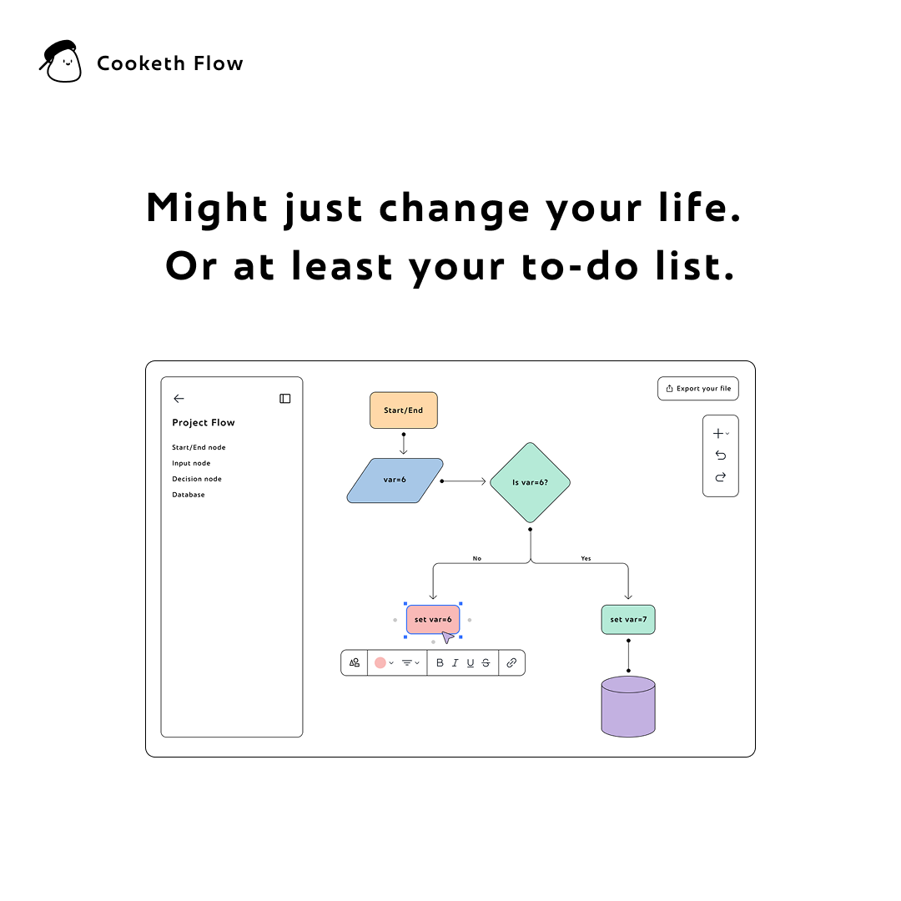

<p align="center">
   <div align="center">

[](https://github.com/CookethOrg)
[](https://github.com/CookethOrg/Cooketh-Flow)


</div>
<div align="center">
  <a href="https://github.com/CookethOrg/Cooketh-Flow">
  
     </a>
</div>
<h2 align="center">Cooketh Flow</h2>
<p align="center"> Transform chaos into clarity. </p>
<br />
<!-- <br /> -->

 [Cooketh Flow](https://cookethflow.framer.website/) is an open-source, powerful visual thinking and unified productivity tool designed for teams and individuals to brainstorm, sketch, and organize ideas effortlessly. Whether you're mapping out ideas, designing user flows, organizing tasks or simply just taking notes, Cooketh Flow provides an intuitive interface for organizing and executing tasks effortlessly.   <!-- <div align="center">
  <a href="https://github.com/CookethOrg/Cooketh-Flow">
  
     </a>
</div> -->

---

[](https://CookethOrg/Cooketh-Flow) [](https://github.com/CookethOrg/Cooketh-Flow/commits/) [](https://github.com/CookethOrg/Cooketh-Flow)


## ✨ Features  

- 🔗 **Collaborate** – Work together, wherever you are. Invite teammates to brainstorm, map flows, or build diagrams with you. Co-create without missing a beat.
- 📂 **All-in-One Workspace** – Create flowcharts, map ideas, leave comments, and organize everything — all in one streamlined canvas.
- ☁ **Works Everywhere** – Access your boards on desktop, tablet, or mobile, Cooketh Flow runs smoothly across all your devices.

---

## 🛠️ Tech Stack  

| Technology | Purpose |
|------------|---------|
| **Flutter** | Cross-platform UI development |
| **Supabase** | Backend & real-time sync |

---

## 🚀 Setup & Installation

### Prerequisites  
- Flutter SDK installed  
- Supabase project setup  
- A code editor (VS Code / Android Studio recommended)  

### Installation Steps
Cooketh Flow is currently available in alpha version for web only.
Check out the [live site](https://cookethflow.cookethcompany.xyz/)

### Setup for build
```bash
# Clone the repository
git clone https://github.com/your-username/Cooketh-Flow.git
cd cooketh-flow

# Install dependencies
flutter pub get

# Run the app
flutter run
```
---
## 📜 License  

This project is licensed under the **MIT License** – see the [`LICENSE`](LICENSE) file for details.
<br>
I, [Subroto Banerjee](https://github.com/TeeWrath), am the Benevolent Dictator For Life (BDFL) of [Cooketh Flow](https://github.com/CookethOrg/Cooketh-Flow), leading its vision and development. I welcome contributions under our MIT license to make this tool awesome!

---

Made with ❤️